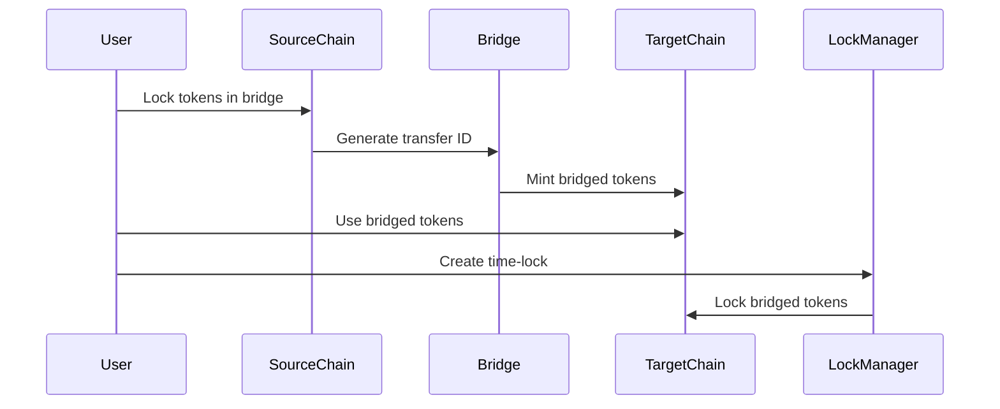

# FlashVault Bridge Integration Guide

## Overview

This guide explains how to integrate the new bridge contracts (`TetherUSDBridgedZED20` and `TokenBridge`) with the existing FlashVault time-locking system. The integration enables cross-chain token transfers while maintaining the core time-locking functionality.

## Architecture

```
┌─────────────────┐    ┌─────────────────┐    ┌─────────────────┐
│   Source Chain  │    │   Bridge        │    │   Target Chain  │
│   (BSC Mainnet) │◄──►│   Contract      │◄──►│   (BSC Testnet) │
└─────────────────┘    └─────────────────┘    └─────────────────┘
         │                       │                       │
         │                       │                       │
         ▼                       ▼                       ▼
┌─────────────────┐    ┌─────────────────┐    ┌─────────────────┐
│   USDT Token    │    │   FlashVault    │    │   Bridged USDT  │
│   (Original)    │    │   LockManager   │    │   (ZED20)       │
└─────────────────┘    └─────────────────┘    └─────────────────┘
```

## Contract Integration

### 1. TetherUSDBridgedZED20 Token

**Purpose**: ERC-20 token representing bridged USDT on the target chain

**Key Features**:
- 6 decimal precision (matching USDT standard)
- Mintable/burnable by authorized bridge
- Ownable for administrative control
- Emergency recovery functions

**Integration Points**:
- Used by `TokenBridge` for cross-chain transfers
- Integrated with `LockManager` for time-locking
- Maintains USDT compatibility

### 2. TokenBridge Contract

**Purpose**: Handles cross-chain token transfers and locking

**Key Features**:
- Token locking on source chain
- Token unlocking on target chain
- Relayer authorization system
- Pausable operations
- Reentrancy protection

**Integration Points**:
- Manages token flow between chains
- Generates unique transfer IDs
- Tracks processed transfers
- Authorizes relayers

### 3. LockManager Integration

**Purpose**: Time-locking functionality for bridged tokens

**Integration Changes**:
- Now accepts bridged USDT token address
- Maintains all existing time-lock features
- Compatible with bridge token decimals
- Same fee structure and limits

## Deployment Process

### Prerequisites

1. **Environment Setup**
```bash
cd contracts
npm install --save-dev hardhat @nomicfoundation/hardhat-toolbox @openzeppelin/contracts dotenv
```

2. **Environment Variables**
Create `.env` file in `contracts/` directory:
```bash
PRIVATE_KEY=your_private_key_here
BSCSCAN_API_KEY=your_bscscan_api_key_here
```

### Deployment Commands

#### Option 1: Deploy Bridge System Only
```bash
# Deploy to BNB Testnet
npm run deploy:bridge:testnet

# Deploy to BSC Mainnet
npm run deploy:bridge:mainnet

# Deploy to local network
npm run deploy:bridge:local
```

#### Option 2: Deploy Complete System
```bash
# Deploy original system
npm run deploy:testnet

# Deploy bridge system
npm run deploy:bridge:testnet
```

### Deployment Output

After successful deployment, you'll get:
- **Token Contract Address**: Bridged USDT token
- **Bridge Contract Address**: Cross-chain bridge
- **LockManager Address**: Time-locking system
- **Deployment JSON**: Configuration file for frontend

## Frontend Integration

### 1. Update Constants

```typescript:src/lib/constants.ts
export const CONTRACTS = {
  // Original USDT (source chain)
  USDT: '0x55d398326f99059fF775485246999027B3197955', // BSC Mainnet
  
  // Bridge System (target chain)
  BRIDGED_USDT: '0x...', // Deployed bridged token address
  BRIDGE: '0x...', // Deployed bridge address
  LOCK_MANAGER: '0x...', // Deployed lock manager address
  
  MULTICALL: '0x6e5bb1a5Ad6F68A8D7D6A5e47750eC15773d6042'
} as const;
```

### 2. Add Bridge Service

```typescript:src/lib/bridgeService.ts
export class BridgeService {
  constructor(
    private bridgeAddress: string,
    private tokenAddress: string
  ) {}
  
  async lockTokens(
    amount: bigint,
    targetChainId: number,
    recipient: string
  ): Promise<string> {
    // Implementation for locking tokens
  }
  
  async unlockTokens(
    transferId: string,
    recipient: string,
    amount: bigint
  ): Promise<string> {
    // Implementation for unlocking tokens
  }
  
  async getBridgeBalance(): Promise<bigint> {
    // Get bridge contract balance
  }
}
```

### 3. Update Lock Service

```typescript:src/lib/locks.ts
// Update to use bridged token
export const lockService = new LockManagerService(CONTRACTS.BRIDGED_USDT);
```

## Usage Workflow

### 1. Cross-Chain Transfer



### 2. Time-Locking Process

1. **Bridge Tokens**: Lock USDT on source chain
2. **Receive Bridged**: Get bridged USDT on target chain
3. **Create Lock**: Use bridged USDT in LockManager
4. **Manage Locks**: Transfer, split, or redeem as needed
5. **Bridge Back**: Unlock and bridge back to source chain

## Testing

### 1. Local Testing
```bash
# Start local node
npm run node

# Deploy locally
npm run deploy:bridge:local

# Run tests
npm test
```

### 2. Testnet Testing
```bash
# Deploy to testnet
npm run deploy:bridge:testnet

# Test bridge functionality
# Test lock manager integration
# Verify on BSCScan testnet
```

### 3. Integration Testing
- Test token bridging between chains
- Verify LockManager works with bridged token
- Test all time-locking features
- Validate fee calculations

## Security Considerations

### 1. Bridge Security
- **Relayer Authorization**: Only authorized relayers can unlock tokens
- **Transfer ID Uniqueness**: Prevents double-spending
- **Pausable Operations**: Emergency stop capability
- **Reentrancy Protection**: Prevents attack vectors

### 2. Token Security
- **Mint/Burn Control**: Only bridge can mint/burn
- **Ownable Functions**: Administrative control
- **Emergency Recovery**: Recover accidentally sent tokens

### 3. LockManager Security
- **Existing Protections**: All original security features
- **Token Validation**: Ensures token compatibility
- **Fee Protection**: Maintains fee structure integrity

## Monitoring and Maintenance

### 1. Contract Monitoring
- Monitor bridge balance
- Track transfer success rates
- Monitor gas costs
- Alert on failed transactions

### 2. Relayer Management
- Authorize new relayers as needed
- Monitor relayer performance
- Revoke underperforming relayers
- Maintain relayer redundancy

### 3. Emergency Procedures
- Pause bridge operations if needed
- Emergency token withdrawals
- Contract upgrades (if upgradeable)
- Incident response protocols

## Troubleshooting

### Common Issues

1. **Token Approval Failures**
   - Ensure sufficient allowance
   - Check token contract permissions
   - Verify token address

2. **Bridge Transaction Failures**
   - Check gas limits
   - Verify network configuration
   - Ensure sufficient balance

3. **Lock Manager Integration Issues**
   - Verify token decimals match
   - Check token approval
   - Validate contract addresses

### Debug Commands

```bash
# Check contract state
npx hardhat console --network bnbTestnet

# Verify deployment
npx hardhat verify --network bnbTestnet CONTRACT_ADDRESS

# Check logs
npx hardhat run scripts/check-logs.js --network bnbTestnet
```

## Future Enhancements

### 1. Multi-Chain Support
- Support for additional chains
- Cross-chain lock management
- Unified bridge interface

### 2. Advanced Features
- Automated relayer system
- Cross-chain lock transfers
- Yield generation integration
- NFT representation

### 3. Performance Optimization
- Batch operations
- Gas optimization
- Layer 2 integration
- Cross-chain messaging

## Support

For technical support or questions:
- **Documentation**: Refer to `FLASHVAULT_SPECS.md`
- **Issues**: Check deployment logs and contract state
- **Development**: Use Hardhat console for debugging
- **Community**: Join project community channels

---

*This guide covers the integration of bridge contracts with the FlashVault system. For detailed contract specifications, refer to the individual contract files and the main system documentation.*
